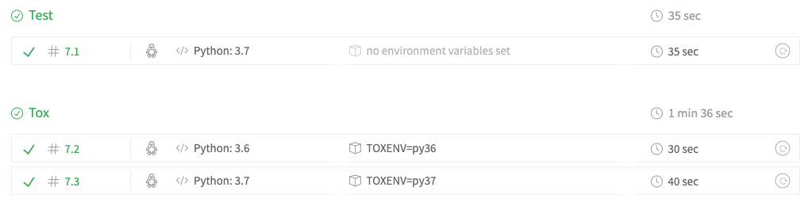

# CSCI Utils

Common utilities for CSCI E-29 psets

A common practice is to keep work for every problem you solve in its own repo or
python package, especially if you plan on reusing it across projects.

However, this can be burdensome if you need a new package for *every little
thing.*  Here, we will explore a compromise paradigm that will simultaneously
give us isolation and repeatability without creating needless boilerplate.

<!-- START doctoc generated TOC please keep comment here to allow auto update -->
<!-- DON'T EDIT THIS SECTION, INSTEAD RE-RUN doctoc TO UPDATE -->
**Table of Contents**  *generated with [DocToc](https://github.com/thlorenz/doctoc)*

- [Preface](#preface)
  - [Cookiecutter](#cookiecutter)
  - [Git flow](#git-flow)
- [Problems](#problems)
  - [Bootstrapping CSCI Utils](#bootstrapping-csci-utils)
    - [Settings](#settings)
    - [Oops!](#oops)
    - [Linking to github](#linking-to-github)
    - [Limiting builds and other fixes](#limiting-builds-and-other-fixes)
    - [Pushing to github](#pushing-to-github)
    - [Cleaning up](#cleaning-up)
  - [Adding docker and pipenv](#adding-docker-and-pipenv)
    - [Bootstrapping docker (if you use docker)](#bootstrapping-docker-if-you-use-docker)
    - [Create a pipenv app](#create-a-pipenv-app)
    - [Back to Docker (if necessary)](#back-to-docker-if-necessary)
    - ['Main' tests and Code Climate](#main-tests-and-code-climate)
  - [Versioning](#versioning)
  - [Black precommit hooks](#black-precommit-hooks)
  - [Atomic (re)writes](#atomic-rewrites)
  - [Hashing, etc](#hashing-etc)
  - [Optional: refactor pset 1](#optional-refactor-pset-1)
    - [Private Repo Authentication](#private-repo-authentication)
      - [Create a Github API token](#create-a-github-api-token)
      - [Add authentication to pset 1 repo](#add-authentication-to-pset-1-repo)
    - [Install the utils!](#install-the-utils)
    - [Including the utils tests](#including-the-utils-tests)
    - [Updating](#updating)

<!-- END doctoc generated TOC please keep comment here to allow auto update -->

## Preface

**DO NOT CLONE THIS REPO LOCALLY YET**.  We will manually create a repo and link
it.  If you have cloned this repo locally, simply delete it (it's fine if it's
already forked on github).

### Cookiecutter

We will leverage the templating system
[CookieCutter](https://cookiecutter.readthedocs.io/en/latest/) to give us a head
start on best python practices.  Please see the docs for installation.

On Mac with [Homebrew](https://brew.sh/):

```bash
brew install cookiecutter
```

Cookiecutter has many template projects for various systems, and they are worth
exploring.  For now, we'll use `cookiecutter-pylibrary`.

Cookiecutter uses the templating language
[Jinja2](http://jinja.pocoo.org/docs/2.10/).  When you see something like `My
name is {{ name }}` it means it will be rendered using the variable `name` when
the project is created.

Refer to the [cookiecutter
docs](https://cookiecutter.readthedocs.io/en/latest/usage.html) for additional
instructions.

### Git flow

For a package/library, it is especially important that your branching workflow
reflect the 'production' status of your library.

After your initial tag commit of this repo, you ***must*** conform to a formal
git workflow.  This means:

1. Pick [Git Flow](https://nvie.com/posts/a-successful-git-branching-model/) or
   the simplified [Github Flow](https://guides.github.com/introduction/flow/)
   or some similar variant.
   * Git Flow has a 'development' branch that is good for quick iterative work,
     but is slightly more complicated otherwise.  Sourcetree has built in tools
     for using it, including automatic tagging.
   * Git Flow will help automate tagging
   * Github Flow means everything is a branch off master.
2. Your `master` branch should be merge-only.  That is, never commit work to it
   directly, only merge from `feature/*`, `develop`, `hotfix/*`, or similar
3. Each new merged commit on master must have a
   [Semantic Versioning](https://semver.org/) release version with an
   accompanying tag.  TL;DR:
   * `major.minor.patch`
   * Patch is for bugfix
   * Minor is for new features
   * Major is for backwards-incompatible changes
   * Don't worry about high version numbers
   * tags should be of the form `v0.1.2`
4. Your work will be graded on your latest tagged version, which should be
   the same as your `master`


## Problems

### Bootstrapping CSCI Utils

For an ongoing library, we'd like to use
[cookiecutter-pylibrary](https://github.com/ionelmc/cookiecutter-pylibrary) as
our templated "Encapsulated Best Practices."

***NB***: If you were a student in an earlier semester of this course and
attempted this problem set, note the
[CHANGELOG](https://github.com/ionelmc/cookiecutter-pylibrary/blob/master/CHANGELOG.rst)
for this cookiecutter.  You are required to regenerate (or update) your earlier
pset to conform to the new cookiecutter standards.

Please read through the two linked posts at the top of that page to better
understand why we chose this template.

Try rendering out a library with a few different defaults and see what it
generates:

```bash
cookiecutter gh:ionelmc/cookiecutter-pylibrary
```

(Note you may see errors, ensure you have `tox` and `Jinja2` pip-installed in
your root python environment)

You may delete them when you're done.

#### Settings

Inspect `cookiecutter.json` in the pylibrary repo.  This contains all the
defaults and variables for your project template.  Note that the default value
from a list is the first element; when we clone and modify cookiecutter
templates later, you can reorder as you wish.  

When you're ready to render your utils repo, please use the following settings.

Please put in your name, email, etc. as prompted, and use the table below for
the configurations that we should all have in common. For anything not in this
table, just leave the defaults as-is.  But, since these are private repos, we
need to turn off all external integrations other than travis and codeclimate:

| Param | Value |
|-|-|
| name/email etc | yours |
| repo_username | `csci-e-29` (since the repo lives in the org)|
| project_name | `CSCI Utils` |
| repo_name | `<SEMESTER>-csci-utils-<YOUR_GITHUB_ID>` |
| package_name | (should default to `csci_utils`) |
| Select license | `no` |
| Select test_runner | `pytest` |
| setup_py_uses_setuptools_scm | `yes` |
| Select pre_commit | `yes` |
| pypi_badge | `no` |
| pypi_disable_upload | `yes` |
| allow_tests_inside_package | `yes` |
| Select command_line_interface | `argparse` |
| travis | `yes` |
| codecov, coveralls, appveyor, requiresio, etc | `no` |
| Select codeclimate | `yes` |

#### Oops!

There are a lot of options!  Don't worry if you make a mistake entering one,
cookiecutter will spit out instructions on how to regenerate the template.

See the notes inside the rendered `.cookiecutterrc` for details or just run
(from the same directory you ran the first time):

```bash
cookiecutter --overwrite-if-exists --config-file=<rendered_template>/.cookiecutterrc gh:ionelmc/cookiecutter-pylibrary
```

This should ask the same q's again, but defaulting to the values you used last
time.

#### Linking to github

Cookiecutter prints these instructions for linking to this repo.  Don't push
yet!

```bash
cd <SEMESTER>-csci-utils-<YOUR_GITHUB_ID>
git init
git add --all  # though nicer if you do this manually/via SourceTree
git commit -m "Add initial project skeleton."
git remote add origin git@github.com:csci-e-29/<SEMESTER>-csci-utils-<YOUR_GITHUB_ID>.git

# Hold on!
# git push -u origin master
```

#### Limiting builds and other fixes

To help limit builds, let's cut down the test matrix before you push to github.

- Remove or clear the [LICENSE](LICENSE) file, if present
- In [setup.py](setup.py):
  - comment out links to ReadTheDocs
  - `python_requires='>=3.6',`
- Erase the `tests/` directory (use tests in packages instead)
- Remove python 2 and versions below 3.6 from [tox.ini](tox.ini), and [setup.py](setup.py),
  and [.travis.yml](.travis.yml).  When Travis runs, it should only have 3 build steps for 3.6, 3.7 and 3.8.  Remove any other python builds (eg pypy).
- In [setup.cfg](setup.cfg) add `--cov=csci_utils` and `--cov-branch` to `addopts`
- In [.travis.yml](.travis.yml):
  - Comment out/remove the top level env matrix including `TOXENV=docs` and `TOXENV=check`.  You can add them back in later, but they are overly sensitive for now.
  - Set the default python to 3.7 by adding `python: 3.7` as the second line, below `language=python`
  - Change `pip install tox` to `pip install tox-travis` in the install stanza


#### Pushing to github
Commit changes from above to your local master branch.

Because this repo isn't empty, we need to merge the remote origin locally before
pushing.  In SourceTree, you'll notice two distinct histories.  Merge them
manually or:

```bash
git fetch
git merge origin/master --allow-unrelated-histories
# Note this will ask you to save a commit message.  If you're unfamiliar with
# vim, you may need to type ':wq' or Esc then `:wq`
git push -u origin master
```

You should now see this README as well as your template in github!  You'll need
to take these steps for all CookieCutter template renders to sync them up
manually with remote pset repos.

#### Cleaning up

Now that you've merged the remote branch, you can add your build badges
to this README and correct the build badges in [README.rst](README.rst)

(If you touched this README first, you may have had merge conflicts before.)

### Adding docker and pipenv

The default project template relies on [travis](https://travis-ci.com/) and
[tox](https://tox.readthedocs.io/en/latest/) for repeatable testing of a matrix
of libraries, which is nice.  For local development though, we'll want to create
a library development app.

#### Bootstrapping docker (if you use docker)

There's a bit of a chicken-and-an-egg problem to work around here.  We need to
install our package into the docker image with pipenv, but since we don't
actually include the entire git repo and code in the docker image (rather, we
mount it after the dependencies are installed), it can't actually do so!  Note
things like the `read` function in [setup.py](setup.py) as well as
`setuptools-scm` which  require parts of your repo to be added into the docker
image.  (A standard docker install does not suffer this problem, because it
would add the entire repo to the image.  However, this would require us to
rebuild the image on every code change, which is very inconvenient.)

The following will disable parts of your code when you are building the docker
image without changing your actual package when it is installed.

Don't commit any changes until you successfully run `pipenv install -e .` below

1. Copy over the `Dockerfile`, `docker-compose.yml`, and `drun_app` files from
Pset 1

2. In the `Dockerfile`:

    1. Comment out all the lines pertaining Pipfile etc below `WORKDIR ...`

    2. Add the following below `WORKDIR`:

        ```yaml
        WORKDIR ...
        COPY setup.py .
        COPY src/csci_utils/__init__.py src/csci_utils/__init__.py
        # COPY Pipfile .
        ...
        ```
    3. Add `ARG DEV_CSCI_UTILS` just after the first `FROM ...` line

3. In `docker-compose.yml`, add a build arg, so that it looks like:

    ```yaml
    build:
      context: .
      args:
        - DEV_CSCI_UTILS=1
    ```

4. Modify `setup.py`

    1. Add:

        ```python
        from ast import literal_eval
        import os
        DOCKER_DEV = literal_eval(os.environ.get("DEV_CSCI_UTILS", "0"))
        ```
    2. Modify `use_scm_version= ... if not DOCKER_DEV else False`

    3. Modify:

        ```python
        def safe_dev_read(func):
            @wraps(func)
            def wrapper(*a, **k):
                try:
                    ...
                except FileNotFoundError:
                    if DOCKER_DEV:
                        return ""
                    raise
            return wrapper

        @safe_dev_read
        def read(*names, **kwargs):
            ...
        ```

You should now be able to use docker to `pipenv install -e .` below.  Don't
forget to add back the pipenv commands in your Dockerfile before committing and
pushing, and `docker-compose build` after every pipenv operation you execute.

#### Create a pipenv app

The following 'editable' install links to the package in this directory.  You
should never pipenv install anything else for a library; rather, dependencies
should be added into [setup.py](setup.py) and then `pipenv update` or similar.
You may, however, do something like `pipenv install --dev pytest` since those
are not real requirements and pipenv doesn't directly handle `tests_require`.

```bash
# Either direct or via ./drun_app
pipenv install -e .
```

Tox will help you test that you have your dependencies set up correctly

#### Back to Docker (if necessary)

Uncomment the lines you commented out before.  `docker-compose build` and
`drun_app` should now work.

You can now commit the docker and pipenv files.

#### 'Main' tests and Code Climate

We also need to reconcile the tox matrix with the single job needed for coverage
etc reporting in Code Climate.  Create two build stages, 'test' and 'tox', and
add in the code climate config from Pset 1 to your travis file.  Designate
***all*** the tox builds as the tox stage, and only run them on the master
branch. It should look something like this:

```yaml
...
matrix:
  include:
    ...
    - env:
        - TOXENV=py36
      python: '3.6'
      stage: tox
      ...
    - stage: test
      python: '3.7'
      install:
          - pipenv install --dev --ignore-pipfile --deploy
      before_script: # code coverage tool
          - curl -L https://codeclimate.com/downloads/test-reporter/test-reporter-latest-linux-amd64 > ./cc-test-reporter
          - chmod +x ./cc-test-reporter
          - ./cc-test-reporter before-build
      script: pytest --cov-report xml --cov-report term
      after_script:
          - ./cc-test-reporter after-build --exit-code $TRAVIS_TEST_RESULT

stages:
  - test
  - name: tox
    if: branch = master
...
```

This should run your Pipenv env and tests first, pushing results to CodeClimate,
and only run the tox matrix if that passes.

When Travis runs, you should see something like this.  Ensure you have 1 build
for Test and Tox builds for python 3.6, 3.7, and 3.8:



### Versioning

Cookiecutter configures your repo to use
[setuptools_scm](https://github.com/pypa/setuptools_scm/) to automatically get
your package version from your git repository.  Note, however, it may not fully
configure things as we wish.

NB: If you see any references to manually coded versions or bumpversion, delete them.

For this course, we care less how setuptools_scm is configured, so long as we
can get the version in two ways:

```bash
python setup.py --version
python -c "import csci_utils; print(csci_utils.__version__)"
```

Both commands should print the same thing, which will look something like this:
`0.0.1.dev4+gdfedba7.d20190209`.

Once you have your `setup.py` and `__init__.py` configured so the above works,
***git tag*** your master `v0.1.0` (eg, `git tag v0.1.0`).  Now verify:

```bash
python setup.py --version  # Should print a clean semantic version
```

From now on, all commits on master must have an accompanying semantic version
tag.

When you later install this project into a problem set, if installed from a
clean repo with a tag version, you'll get a nice version like `0.1.2`.  If,
however, you inspect the `__version__` in your package from your git repo,
you'll get an informative 'dirty' version number like
`'0.2.1.dev0+g850a76d.d20180908'`. This is useful for debugging, building sphinx
docs in dev, etc, and you never have to specify a version except via tagging
your commit.

### Black precommit hooks

Notice that cookiecutter gives you a
[.pre-commit-config.yaml](.pre-commit-config.yaml).  Use this to configure a
precommit hook for black. See [pre-commit](https://pre-commit.com/) for details.

This will prevent you from committing files that are not black formatted.

Feel free to add [any other hooks](https://pre-commit.com/hooks.html) you wish.

### Atomic (re)writes

During a late-night reading session, you notice that someone else has
implemented an [atomic writer](https://pypi.org/project/atomicwrites/) for
python!  Almost certainly they have done a better job of ensuring it works
correctly, and we don't want the responsibility of maintaining this kind of
thing!

You should ***rewrite your atomic_write***
function in this repository.  Create a file structure like:

```
src/
  csci_utils/
    __init__.py
    io/
      __init__.py
      tests.py # or tests/__init__.py, tests/test_io.py, etc
```

Note that the `atomicwrites` package may not implement every feature you did,
such as preserving the extension.  You must find a way to ensure they are still
implemented! All the tests from your previous problem set should pass.

Here are a few tips you can use:

```python

# You can import and rename things to work with them internally,
# without exposing them publicly or to avoid naming conflicts!
from atomicwrites import atomic_write as _backend_writer, AtomicWriter

# You probably need to inspect and override some internals of the package
class SuffixWriter(AtomicWriter):

    def get_fileobject(self, dir=None, **kwargs):
        # Override functions like this
        ...

@contextmanager
def atomic_write(file, mode='w', as_file=True, new_default='asdf', **kwargs):

    # You can override things just fine...
    with _backend_writer(some_path, writer_cls=SuffixWriter, **kwargs) as f:
        # Don't forget to handle the as_file logic!
        yield f
```

Remember: do not `pipenv install atomicwrites`.  This is now a project
dependency and must be included in your [setup.py](setup.py).

### Hashing, etc

Port over everything else from pset 1 you may want to reuse in the future.
Ensure the tests are included ***inside*** the csci_utils package, as we will
test them in future application environments.

Continue to add functionality to this repo as we go along the course!

### Optional: refactor pset 1

If you'd like, go back and update pset 1 to use this repo.  We won't come back
to pset 1 directly, but this will give you a head start configuring new repos to
use your utils library.

***All instructions below refer to your pset 1 repo, not csci_utils.***

#### Private Repo Authentication

Normally, we can pip/pipenv install straight from github (or any git repo) to
any Docker image or Travis build.  However, we have a few hoops to jump through
since `csci_utils` is a private repo and we're not managing all of the deploy
keys.  Inside a company with a private VPN/git server/build system, best
practice is just to make everything publicly readable behind the VPN and not
deal with deploy authentication.

We have a few choices:

1. Create a deploy/user key for SSH.  This is preferred, but is a bit trickier
   to manage, especially on windows.
2. Hard code your git username/password into your dockerfile (no, we are not
   going to do that!)
3. Provide an API token through the environment.  This will allow us to clone
   via https without altering our Pipfile.  This option should be the easiest
   for this class.


##### Create a Github API token

See Travis docs
[here](https://docs.travis-ci.com/user/private-dependencies/#api-token). Note:
To access personal tokens, on the GitHub Applications page, you need to click
Developer Settings, or directly navigate
[here](https://github.com/settings/tokens).

DO NOT SHARE THIS TOKEN WITH ANYONE.  It gives access to all your github repos.
If it becomes compromised, delete it from github and generate a new one.  You
will be uploading this token to Travis, but it is private only to you.

For more reference on security, see [Travis Best
Practices](https://docs.travis-ci.com/user/best-practices-security/#recommendations-on-how-to-avoid-leaking-secrets-to-build-logs)
and [Removing Sensitive
Data](https://help.github.com/articles/removing-sensitive-data-from-a-repository/).

##### Add authentication to pset 1 repo

Add the following lines to the Dockerfile, just below
the `FROM` line:

```docker
ARG CI_USER_TOKEN
RUN echo "machine github.com\n  login $CI_USER_TOKEN\n" >~/.netrc
```

And modify the build section in the `docker-compose.yml`:
```
build:
  context: .
  args:
    - CI_USER_TOKEN=${CI_USER_TOKEN}
```

You then need to set `CI_USER_TOKEN` as an environment variable or in your
[dotenv](https://docs.docker.com/compose/env-file/) file.

If you're not using docker, you can add the .netrc to your host system
(mac/linux) or try [this solution on
Windows](https://stackoverflow.com/questions/6031214/git-how-to-use-netrc-file-on-windows-to-save-user-and-password)
with the token coded directly into the file.

If you don't do this step directly, pip install will ask for your github
credentials and pipenv will hang indefinitely when you try to install from a
private repo.

You must then add the variable to the Travis environment as well; you can do
that via navigating to the settings, eg
https://travis-ci.com/csci-e-29/your_repo/settings, via the [Travis
CLI](https://github.com/travis-ci/travis.rb), or encrypting into the
`.travis.yml` as instructed on the first Travis link above.  The token should
NOT be committed to your repo in plain text anywhere.

In `.travis.yml`, you can also add:
```
before_install:
- echo -e "machine github.com\n  login $CI_USER_TOKEN" > ~/.netrc
```
Note that we may switch to docker builds instead of travis builds in the future;
if travis is building via the docker env, setting the netrc file in docker is
sufficient.

#### Install the utils!

You can now install your `csci_utils` as below.  Note that the #egg part is
important, it is not a comment!

```bash
pipenv install -e git+https://github.com/csci-e-29/<SEMESTER>-csci-utils-<GITHUBID>#egg=csci_utils
```

This will include the latest master commit (presumably tagged) and will be
automatically updated whenever you run `pipenv update`.  If you want to be more
specific about the version, you can use the `@v1.2.3` syntax when you install,
or add `ref='v1.2.3` to the specification in the `Pipfile`.  Leaving this to
automatically check out the latest master is easiest and a good reason to have
merge-only master releases!

#### Including the utils tests

In your `setup.cfg`, ensure the `addopts` section includes `--pyargs`.  At
this point, after building the docker image, `pytest csci_utils` should run all
the tests in your utils package!

You can run them by default if you like, by adding `csci_utils` to `testpaths`
in the [config
file](https://docs.pytest.org/en/documentation-restructure/how-to/customize.html#confval-testpaths).

Otherwise, you should update your `.travis.yml` to explicitly run them.  You can
do so in the same test stage, or you could create a separate test stage just to
test your utils.  Normally, the latter is preferred - it gives nice isolation.
However, it will require travis to reinstall the environment, which is
suboptimal.

#### Updating

Every time you push a new master version to github, you may update the installed
version in your pset applications via `pipenv update`
